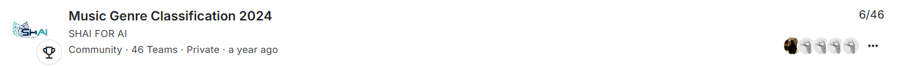
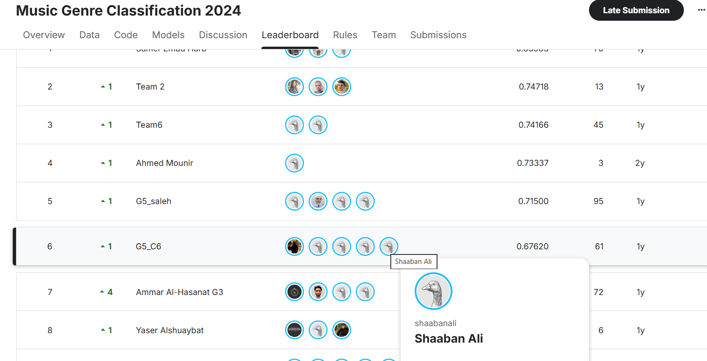

# 🎵 Music Genre Classification – Kaggle Competition (SHAI 2024)
*Class 5 – Group 5*  
*21 August 2024*

---

## 📌 Overview
In this Kaggle competition, we built models to classify songs into genres using audio features such as Popularity, Danceability, Energy, Loudness, Speechiness, Acousticness, Instrumentalness, Tempo, and more.  
The goal was to predict the **Class** value (0 → 10) for each song.

---

## 👥 Team Workflow
Our team followed a collaborative workflow:
- Each member worked independently on their own notebook.
- We compared results continuously throughout the project.
- At the end, we selected the model with the **lowest RMSE** for the Kaggle submission.
- All notebooks were merged into one unified record.

---

## 🧠 Dataset Summary
- **14 Features**  
- **14396 Records**  
- **Target:** Class (0 → 10)

---

## 🛠️ Data Preparation

### 1) Handling Missing Values
- Filling missing values using Mean / Median / Mode  
- Predicting missing values using models  
- Dropping low‑accuracy values  
- Removing duplicated rows  

### 2) Dealing with Columns  
**A – Categorical Data**
- Dropping columns like Artist Name, Track Name  
- OneHotEncoding  
- Target Encoding (same accuracy)

**B – Numerical Data**
- Dropping ID column  
- Standard Scaling  
- Converting “duration_in min/ms” to minutes  

### 3) Feature Selection
- Trying new features (same accuracy)  
- Removing outliers using IQR  

---

## 📊 Visualizations
Below are the images included in the project:

### Competition Page

### Leaderboard

---

## 🔄 Transformations
We analyzed skewness before and after transformations.  
Several features improved significantly after applying transformations such as log-scaling and normalization.

---

## 🤖 Model Performance (F1-Score)

| Model        | F1-Score |
|--------------|----------|
| **CatBoost** | **0.70106** |
| Random Forest | 0.6037 |
| XGBoost       | 0.6160 |
| LightGBM      | 0.5701 |

---

## 🏆 Final Result
- **Public Score:** 7  
- **Private Score:** 6  
- **Kaggle Submission Score:** 0.67620  

---

## 📉 Why Kaggle Score (0.67620) Is Lower Than Local F1-Score (0.70106)

The difference between our local model performance and the Kaggle leaderboard score is expected and completely normal. Our best model (CatBoost) achieved an F1-score of 0.70106 during local evaluation, while the Kaggle public score was 0.67620. This gap can be explained by several factors:

- **Different evaluation metric:**  
  Kaggle evaluates submissions using RMSE, while our internal comparison relied mainly on F1-score. These metrics measure performance differently, which naturally leads to different results.

- **Unseen test data:**  
  Kaggle uses a hidden test set that the model has never seen before. Even a strong model may perform slightly lower on completely unseen data.

- **Mild overfitting:**  
  Since we selected the model with the best performance on our training/validation split, it may have learned patterns specific to that data, causing a small drop when evaluated on Kaggle’s test set.

- **Feature limitations:**  
  As shown in our analysis, creating new features or removing outliers did not significantly improve accuracy. This suggests that the dataset has limited signal, making small score drops expected.

Overall, a Kaggle score of **0.67620** is consistent with our internal results and reflects a stable, well‑generalized model.

---

## 🙏 Thank You
Project completed by **Class 5 – Group 5**  
SHAI 2024 – 21 August 2024
